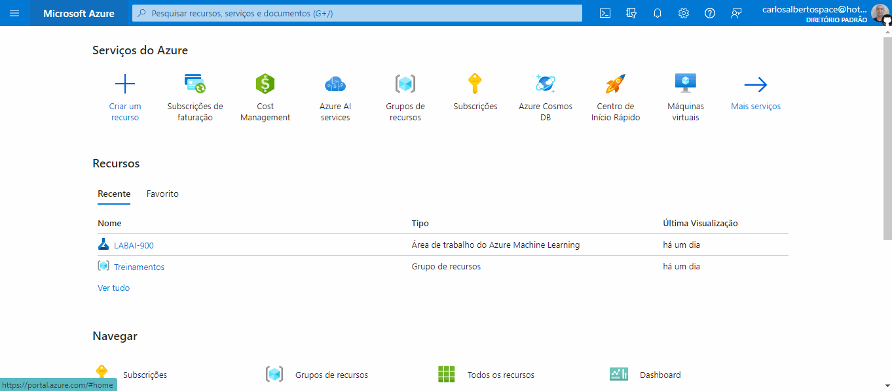
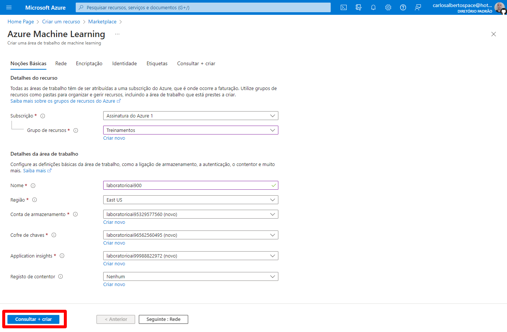
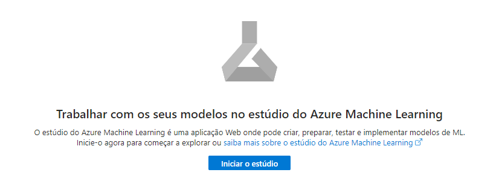
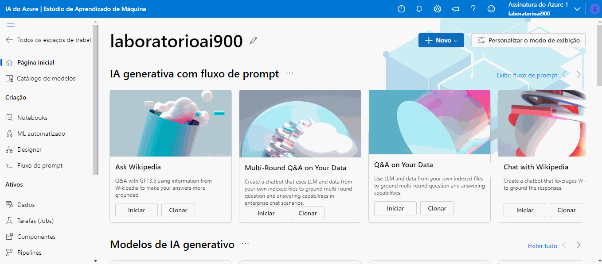
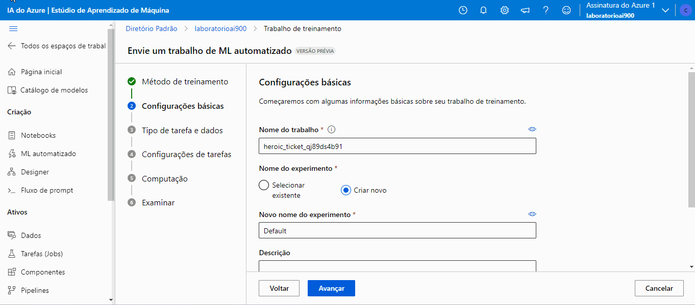
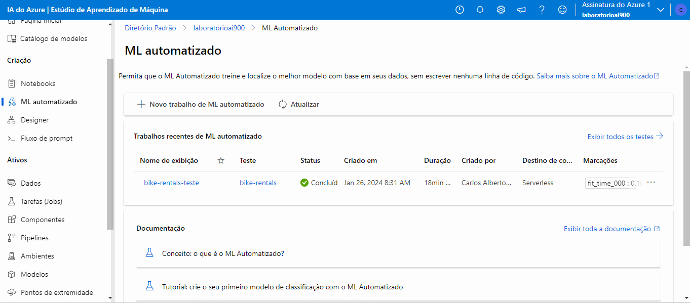

# Trabalhando com Machine Learning na Prática no Azure ML

Passo a passo do projeto Trabalhando com Machine Learning na Prática no Azure ML da DIO.

Links importantes:

[Explore Azure AI Services](https://microsoftlearning.github.io/mslearn-ai-fundamentals/Instructions/Labs/02-content-safety.html)

[Explore Automated Machine Learning in Azure Machine Learning](https://microsoftlearning.github.io/mslearn-ai-fundamentals/Instructions/Labs/01-machine-learning.html)

[Fonte dos dados](https://aka.ms/bike-rentals)

## Passo 1: Criando recurso do Azure Machine Learning

Primeiro precisei criar um recurso de Machine Learning. Para isso, cliquei em "Criar recurso" e depois pesquisei por Azure Machine Learning no marketplace. Após encontrar o recurso, crie ele.

## Passo 2: Configurando o recurso do Azure Machine Learning

Na aba de Noções básica, Detalhes do recurso, é informei a assinatura para cobrança no campo Assinatura e depois informei o Grupo de recursos que vai englobar o recurso que será criado.

Após, em Detalhes da área de trabalho, é informei os detalhes do workspace que será criado. Como foi um laboratório, as configurações foram mínimas. Por fim, criei o recurso clicando em Consultar + criar.

Após o recurso ser criado, cliquei no botão "Ir para o recurso" para acessar a página do recurso. Nessa página, existe o botão "Iniciar o estúdio" que redirecionará para o estúdio do Azure Machine Learning.

## Passo 3

No estúdio, na página do workspace criado anteriormente, acessei a opção do menu ML automatizado e na página aberto, cliquei em "Novo trabalho de ML automatizado".

Em "Configurações básicas", preenchi os campos "Nome do trabalho", "Novo nome do experimento" e "Descrição". Após cliquei em "Avançar".

No passo "Tipo de tarefa e dados", selecionei o tipo de tarefa como Regressão e em seguida, em "Selecionar dados", cliquei em "Criar". No modal aberto, em "Tipos de dados", preenchi os campos "Nome", "Descrição" e escolhi "Tipo" como Tabular. Cliquei em "Avançar" e no passo "Fonte de dados", escolhi "De arquivos da Web" e cliquei em avançar novamente.

No passo "URL da Web", informei a URL https://aka.ms/bike-rentals do conjunto de dados. No passo "Configurações", preenchi as configurações do conjunto e após avançar para "Esquema", verifiquei os tipos de dados. Finalmente, ao avançar, verifiquei as configurações criadas para o ativo de dados e cliquei em criar.

Após finalizar o trabalho de treinamento, o modelo fica acessível na opção de menu "Modelo".

## Passo 4: Métricas do modelo

Para acessar as métricas do modelo treinado, na página do modelo, acesso o link informado em "Criado por trabalho". Também é possível acessar o trabalho informado na opção do menu "Tarefas (jobs)".

Na página da tarefa, acessei a aba métricas.

## Passo 5: Teste do modelo
